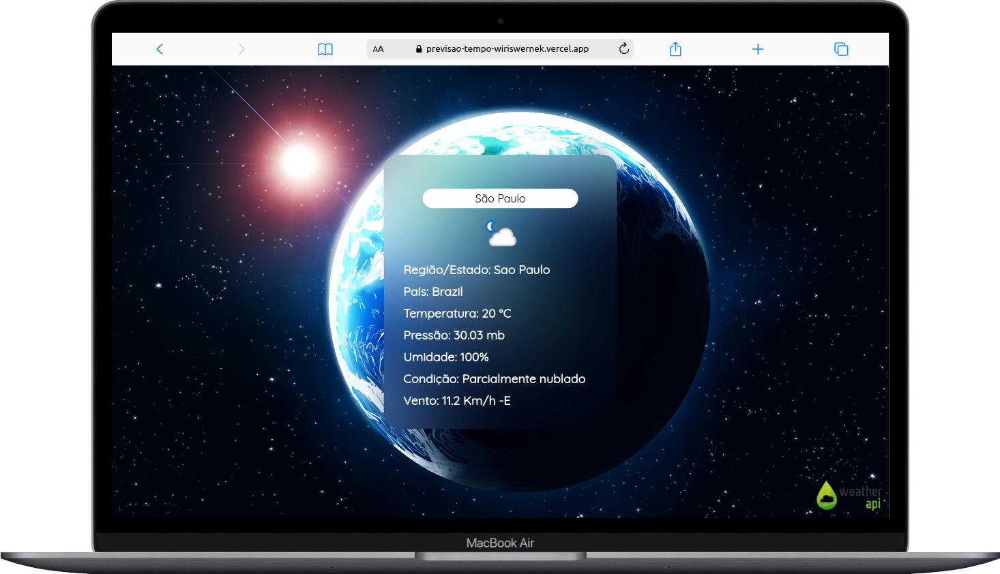
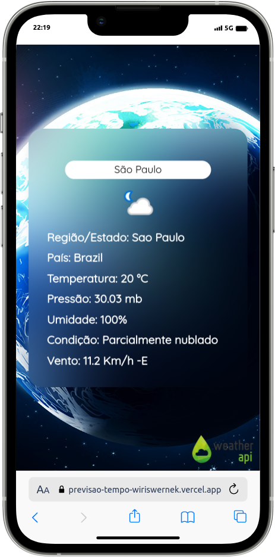

# Previsão do Tempo 

## Sobre

O projeto é aplicação para visualização do clima de qualquer lugar do mundo, de forma responsiva e simplificada.

Atualmente o projeto se encontra publicado na [Vercel](https://previsao-tempo-wiriswernek.vercel.app), e usa como base o Angular com Typescript e Bootstrap 5.

Segue abaixo uma prévia da aplicação.

<h2 align="center">Preview Desktop</h2>

	

<h2 align="center">Preview Mobile</h2>

	

## Como executar esta aplicação?

Para rodar a aplicação voce deve:
- Primeiro clonar este repositório
- Navegar para a pasta `previsao_tempo`
- Executar o comando `npm i` para instalar as dependências do projeto
- Executar o comando `ng s` ou `ng serve` para rodar a aplicação
- Abrir em seu navegador de preferência a URL `http://localhost:4200/` para acessar a aplicação
- Se desejar pode executar diretamente `ng s -o` ou `ng serve --open` para executar a aplicação e abrir automaticamente o navegador já na pagina da aplicação

## Versões dos recursos da aplicação
- angular/cli 
- typescript 
- bootstrap 
